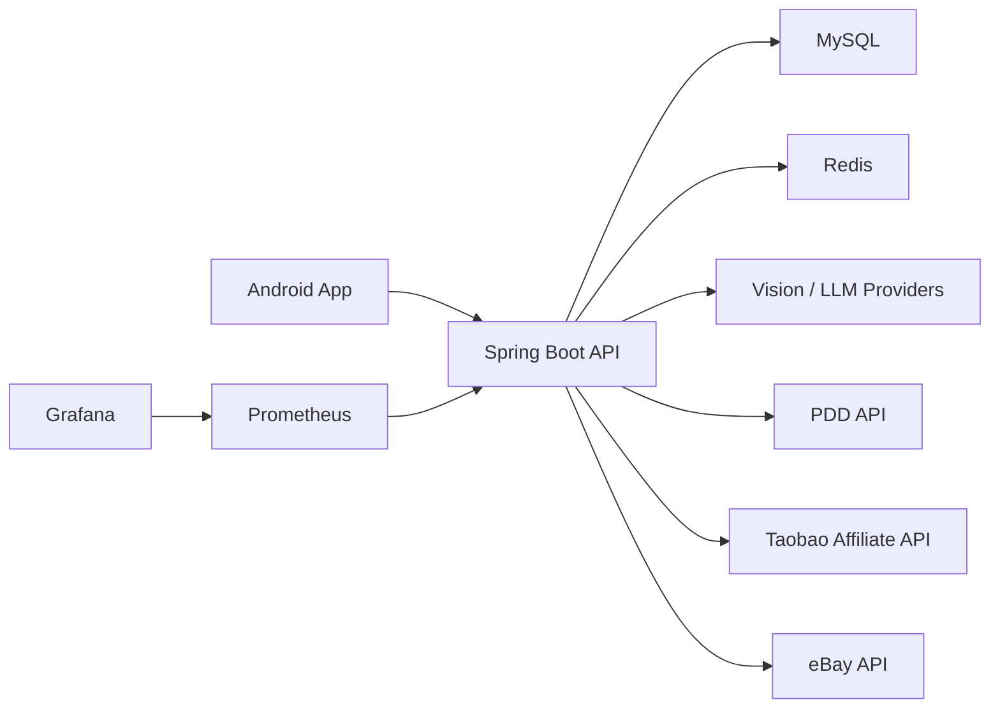

# VisionCart

VisionCart 是一个面向移动端的 AI 智能比价购物助手。用户拍摄或上传商品图片后，后端会识别商品类别与属性，并从拼多多、淘宝联盟、eBay 等平台检索候选商品，提供跨平台比价、自然语言筛选、收藏、历史记录和价格提醒能力。

## 功能特性

- 拍照或截图识别商品，支持多商品候选选择
- 多平台商品检索与比价，支持拼多多、淘宝联盟和 eBay
- 自然语言筛选和排序，例如“只看便宜的”“排除配件”“适合通勤”
- 收藏、历史记录、价格提醒和价格刷新
- Android 悬浮窗入口，支持截图裁剪后快速识别
- Spring Boot 后端，内置鉴权、限流、监控指标、Flyway 数据库迁移
- Docker Compose 一键启动后端、MySQL、Redis、Prometheus 和 Grafana

## 技术栈

| 模块 | 技术 |
| --- | --- |
| Android | Kotlin, Jetpack Compose, Retrofit, Room, WorkManager, CameraX |
| Backend | Java 17, Spring Boot 3.5, Spring Security, Spring Data JPA, Flyway |
| AI | Spring AI 兼容 OpenAI 接口、火山引擎 Ark、阿里云百炼 Qwen-VL |
| 数据与缓存 | MySQL 8.4, Redis 7 |
| 运维监控 | Docker Compose, Prometheus, Grafana, Spring Boot Actuator |

## 架构概览



## 目录结构

```text
VisionCart/
├── android/app/                 Android Kotlin + Jetpack Compose 客户端
├── backend/                     Spring Boot 后端服务
├── deploy/                      Docker Compose、Nginx、监控和服务器部署配置
├── docs/grafana-dashboard.json  Grafana 仪表盘 JSON
├── gradle/                      Gradle Wrapper 文件
├── Dockerfile                   后端容器镜像构建文件
├── run-backend.ps1              Windows 本地后端启动辅助脚本
└── .env.example                 后端环境变量示例
```

## 环境要求

| 依赖 | 版本建议 | 说明 |
| --- | --- | --- |
| JDK | 17 | 后端构建和 Android 编译都使用 Java 17 |
| Android Studio | 稳定版 | 需要 Android SDK，项目 `compileSdk` 为 36，`minSdk` 为 26 |
| Docker Desktop | 可选 | 推荐用于启动 MySQL、Redis、后端和监控组件 |
| MySQL | 8.4 | 不使用 Docker 时需要本地安装 |
| Redis | 7.x | 不使用 Docker 时需要本地安装 |
| adb | 可选 | 命令行安装 APK 到真机或模拟器时使用 |

项目已提交 Gradle Wrapper，不需要单独安装 Gradle。

## 快速开始

### 1. 配置环境变量

```powershell
Copy-Item .env.example .env
```

macOS / Linux:

```bash
cp .env.example .env
```

编辑 `.env`，至少替换以下生产敏感配置：

| 变量 | 说明 |
| --- | --- |
| `JWT_SECRET` | JWT 签名密钥，生产环境必须使用至少 32 字节随机值 |
| `MYSQL_PASSWORD` / `MYSQL_ROOT_PASSWORD` | MySQL 用户和 root 密码 |
| `ARK_API_KEY` / `ARK_VISION_API_KEY` | 火山引擎 Ark LLM 与视觉模型密钥 |
| `ALIYUN_BAILIAN_API_KEY` | 阿里云百炼 Qwen-VL 密钥 |
| `MAIL_USERNAME` / `MAIL_PASSWORD` | 邮箱验证码 SMTP 账号与授权码 |
| `PDD_CLIENT_ID` / `PDD_CLIENT_SECRET` / `PDD_PID` | 拼多多 / 多多进宝 API 配置 |
| `TAOBAO_APP_KEY` / `TAOBAO_APP_SECRET` / `TAOBAO_ADZONE_ID` | 淘宝联盟 API 配置 |
| `EBAY_APP_ID` / `EBAY_CERT_ID` / `EBAY_DEV_ID` | eBay API 配置 |
| `VISIONCART_MONITOR_TOKEN` | Prometheus 访问 `/actuator/prometheus` 的监控令牌 |

`.env`、`local.properties`、keystore、真实密钥、数据库文件和 APK/AAB 不应提交到仓库。

### 2. Docker Compose 启动完整后端环境

```powershell
docker compose --env-file .env -f deploy/docker-compose.yml up -d --build
docker compose --env-file .env -f deploy/docker-compose.yml ps
```

访问入口：

| 服务 | 地址 |
| --- | --- |
| 后端健康检查 | `http://localhost:8080/api/v1/health` |
| Prometheus | `http://localhost:9090` |
| Grafana | `http://localhost:3000` |

停止服务：

```powershell
docker compose --env-file .env -f deploy/docker-compose.yml down
```

Compose 后端默认使用 `SPRING_PROFILES_ACTIVE=prod`，生产 profile 会关闭 Swagger UI 和 OpenAPI 文档。

### 3. 本地 jar 启动后端

适合后端开发调试。需要本机已启动 MySQL 8.4 和 Redis 7.x。

```powershell
.\gradlew.bat :backend:bootJar --no-daemon
.\run-backend.ps1
```

macOS / Linux:

```bash
./gradlew :backend:bootJar --no-daemon
set -a
source .env
set +a
java -jar backend/build/libs/backend-0.1.0.jar
```

启动后检查：

```bash
curl http://localhost:8080/api/v1/health
```

本地 profile 下 Swagger 地址：

```text
http://localhost:8080/swagger-ui.html
```

### 4. 运行 Android 客户端

在根目录创建 `local.properties`：

```properties
sdk.dir=C:/Android/Sdk
VISIONCART_API_BASE_URL=http://10.0.2.2:8080/
```

常见后端地址：

| 场景 | `VISIONCART_API_BASE_URL` |
| --- | --- |
| Android 模拟器访问本机后端 | `http://10.0.2.2:8080/` |
| ADB 端口转发 | `http://localhost:8080/` |
| 正式发布 | `https://your-domain.example.com/` |

构建 Debug APK：

```powershell
.\gradlew.bat :android:app:assembleDebug --no-daemon
```

安装到已连接设备：

```bash
adb install -r android/app/build/outputs/apk/debug/app-debug.apk
```

构建 Release APK：

```powershell
.\gradlew.bat :android:app:assembleRelease --no-daemon
```

Release 构建默认要求 `VISIONCART_API_BASE_URL` 使用公网 HTTPS，不能使用 localhost、`10.0.2.2` 或局域网 IP。签名配置示例：

```properties
VISIONCART_RELEASE_STORE_FILE=keystore/release.jks
VISIONCART_RELEASE_STORE_PASSWORD=replace-with-store-password
VISIONCART_RELEASE_KEY_ALIAS=replace-with-key-alias
VISIONCART_RELEASE_KEY_PASSWORD=replace-with-key-password
```

## 本地监控

如果后端已经在本机或其他环境运行，只想启动 Prometheus 和 Grafana：

```powershell
docker compose -f deploy/local-monitoring/docker-compose.yml up -d
```

`deploy/local-monitoring/prometheus.yml` 默认抓取 `host.docker.internal:8080`，并通过 `deploy/local-monitoring/.env` 中的 `VISIONCART_MONITOR_TOKEN` 注入监控令牌。

停止本地监控：

```powershell
docker compose -f deploy/local-monitoring/docker-compose.yml down
```

## 常用命令

```powershell
# 后端测试
.\gradlew.bat :backend:test --no-daemon

# Android 单元测试
.\gradlew.bat :android:app:testDebugUnitTest --no-daemon

# 后端打包
.\gradlew.bat :backend:bootJar --no-daemon

# Android Debug 包
.\gradlew.bat :android:app:assembleDebug --no-daemon
```

## 安全说明

- 所有平台密钥只放在后端环境变量中，不写入 Android 代码
- 生产环境必须更换 `JWT_SECRET`、数据库密码、SMTP 授权码、监控令牌和平台 API 密钥
- Android Release 默认禁用明文 HTTP，只允许 HTTPS 后端地址
- MySQL 和 Redis 在 Compose 中只绑定 `127.0.0.1`，不会直接暴露到公网
- `/actuator/prometheus` 需要登录管理员身份或 `VISIONCART_MONITOR_TOKEN`
- 用户上传图片、识别历史和商品快照属于敏感业务数据，生产环境应配置备份、保留周期和访问控制

## 贡献开发

提交代码前建议至少运行：

```powershell
.\gradlew.bat :backend:test --no-daemon
.\gradlew.bat :android:app:testDebugUnitTest --no-daemon
```

后端 API 使用统一 `ApiResponse<T>` 响应结构，JSON 字段命名为 `snake_case`。Android API 地址、SDK 路径和 Release 签名都通过根目录 `local.properties` 注入。

## License

VisionCart 使用 [MIT License](LICENSE) 开源。
