# VisionCart 架构设计文档

> 本文档面向项目评审、后续维护和二次开发，说明 VisionCart 的系统架构、核心数据流、模块边界与关键运行时机制。

## 1. 系统概览

VisionCart 是一个 AI 智能比价购物助手，由 Android 客户端和 Spring Boot 后端组成。用户通过拍照、相册上传或悬浮窗截图提交商品图片，后端调用视觉模型识别商品主体与属性，再从拼多多、淘宝联盟、eBay 等平台检索商品，形成跨平台比价结果，并支持自然语言筛选、收藏、识别历史和价格提醒。

系统采用“移动端体验 + 后端智能编排 + 外部平台/AI 能力接入”的分层架构：

- Android 客户端负责拍摄、截图、交互状态、本地缓存和离线可用性。
- Spring Boot 后端负责认证、AI 调用、多平台搜索、排序筛选、历史归档、价格监控和安全边界。
- MySQL 保存用户、历史、收藏、价格提醒等长期数据。
- Redis 保存异步任务、搜索候选池、幂等锁、会话状态和通知去重等运行时数据。
- WebSocket 负责识别进度、搜索阶段结果和价格提醒的实时推送。

## 2. 总体架构

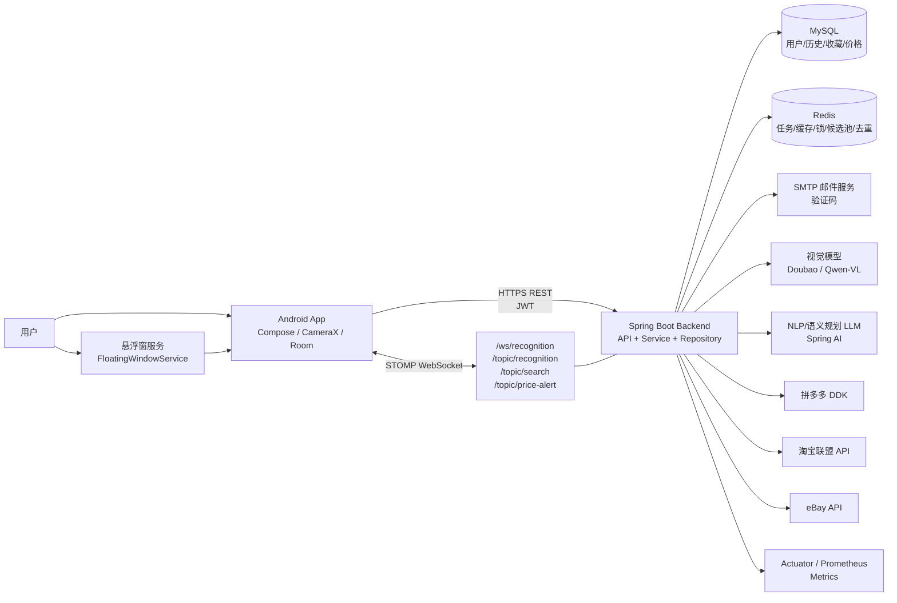

### 2.1 技术栈

| 层级 | 技术与职责 |
| --- | --- |
| Android | Kotlin、Jetpack Compose、CameraX、Room、DataStore、Retrofit、OkHttp、Coil、MediaProjection |
| 后端 API | Spring Boot 3.5、Java 17、Spring MVC、Spring Security、JWT、WebSocket/STOMP |
| 后端数据 | Spring Data JPA、Flyway、MySQL、Redis、Caffeine |
| AI 能力 | Doubao / Qwen-VL 视觉识别、Spring AI LLM、PromptLoader、RetryPolicy、AiTraceService |
| 搜索平台 | 拼多多、淘宝联盟、eBay，通过 `PlatformSearchService` 统一抽象 |
| 可观测性 | Spring Boot Actuator、Micrometer、Prometheus、Grafana |

## 3. 分层与模块边界

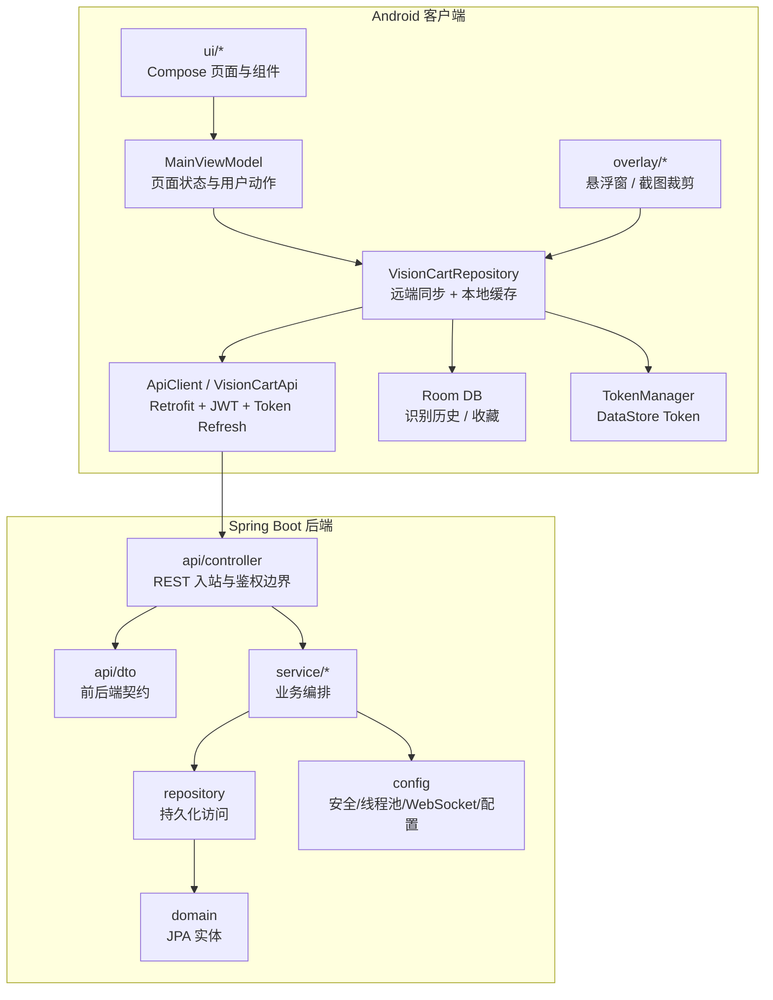

### 3.1 Android 模块边界

| 模块 | 责任 | 不负责 |
| --- | --- | --- |
| `ui/*` | Compose 页面、组件展示、用户输入收集 | 不直接调用 Retrofit，不保存业务数据 |
| `ui/viewmodel/MainViewModel.kt` | 管理识别、搜索、筛选、收藏、历史恢复等 UI 状态；将用户动作转成 repository 调用 | 不实现网络协议细节，不直接访问数据库 DAO |
| `data/repository/VisionCartRepository.kt` | 单一数据入口；处理图片压缩上传、WebSocket/轮询兜底、本地 Room 缓存、收藏/历史同步 | 不决定页面布局，不持有 Compose 状态 |
| `data/ApiClient.kt` | Retrofit 接口定义、OkHttp 拦截器、JWT 携带、401 自动刷新 Token | 不承载业务判断 |
| `data/db/*` | Room 本地缓存：识别历史、收藏列表 | 不是权威数据源，后端 MySQL 才是多设备一致性来源 |
| `overlay/*` | 悬浮球、截图权限、截图裁剪、悬浮面板入口 | 不绕过 repository 直接访问后端 |

### 3.2 后端模块边界

| 模块 | 责任 | 典型类 |
| --- | --- | --- |
| `api/controller` | REST 路由、请求校验、用户归属校验、统一 `ApiResponse<T>` 返回 | `RecognitionController`、`SearchController`、`NlpController`、`UserDataController` |
| `api/dto` | 前后端传输契约，后端 JSON 使用 `SNAKE_CASE` | `RecognitionResult`、`SearchRequest`、`ProductCard`、`ActionResult` |
| `service/recognition` | 图片处理、异步任务、视觉模型调用、多商品候选选择、历史图片保存 | `RecognitionOrchestrator`、`ImageProcessor`、`AsyncRecognitionTaskManager` |
| `service/search` | 多平台召回、缓存、熔断、意图识别、去重、排序、口碑评分、候选池 | `SearchOrchestrator`、`PlatformSearchService`、`CandidateSessionCache` |
| `service/nlp` / `service/filter` / `service/action` | 自然语言解析、语义动作计划、筛选执行、撤销栈、统一用户动作入口 | `ActionExecutionService`、`LlmSemanticPlanner`、`SafeActionExecutor` |
| `service/suggestion` | 推荐卡片生成、深度导购建议、建议卡缓存 | `SuggestionService`、`DeepSuggestionService` |
| `service/price` | 收藏商品价格刷新、价格历史、目标价/历史低价/大幅降价提醒 | `PriceMonitorService`、`PriceAlertScheduler` |
| `service/auth` | 邮箱验证码、JWT/Refresh Token、用户资料 | `AuthService`、`MailService` |
| `domain` / `repository` | MySQL 表结构映射与数据访问 | `User`、`RecognitionHistory`、`FavoriteProduct`、`PriceAlert` |
| `config` | Spring Security、JWT Filter、线程池、WebSocket、OpenAPI、监控和配置绑定 | `SecurityConfig`、`WebSocketConfig`、`AsyncConfig` |

## 4. 后端运行时架构

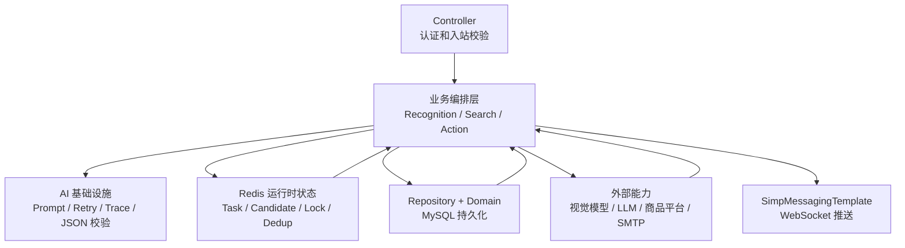

### 4.1 同步接口与异步任务分工

后端对客户端暴露的是同步 REST 接口，但识别和搜索内部会拆成异步或并发执行：

- 识别提交接口 `/api/v1/recognition/analyze` 立即返回 `session_id`、状态和 WebSocket topic。
- `RecognitionOrchestrator` 在线程池中执行图片处理、视觉识别和历史保存。
- 客户端优先通过 WebSocket 获取识别结果，失败时降级为 `/api/v1/recognition/status/{sessionId}` 轮询。
- 搜索接口 `/api/v1/search/products` 内部并行调用平台服务，并通过 `/topic/search/{sessionId}` 推送阶段性结果。
- 价格提醒由定时任务或收藏触发的异步刷新执行，并通过 `/topic/price-alert/{userId}` 推送。

## 5. 核心数据流

### 5.1 登录与认证数据流

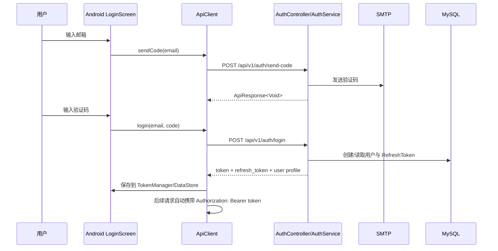

认证边界由后端 Spring Security 和 `JwtAuthenticationFilter` 负责。Android 只保存和携带 Token，不直接持有平台密钥或后端敏感配置。

### 5.2 图片识别数据流

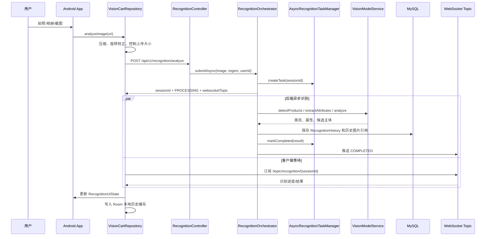

多商品图片会进入候选选择分支：后端先保存候选裁剪图并推送 `MULTI_PRODUCT_PENDING`，客户端展示候选，用户选择后调用 `/api/v1/recognition/{sessionId}/select-product`，后端只对选中的主体继续提取属性。

### 5.3 商品搜索与比价数据流

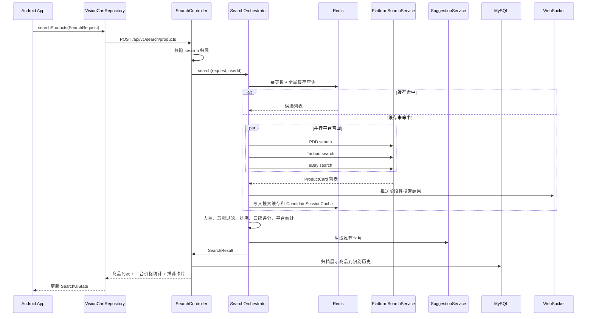

搜索模块通过 `PlatformSearchService` 抽象第三方平台差异，每个平台只负责把外部 API 响应转换成统一 `ProductCard`。平台可用性由配置开关、区域策略、超时和 `PlatformCircuitBreaker` 共同控制。

### 5.4 自然语言筛选与统一动作数据流

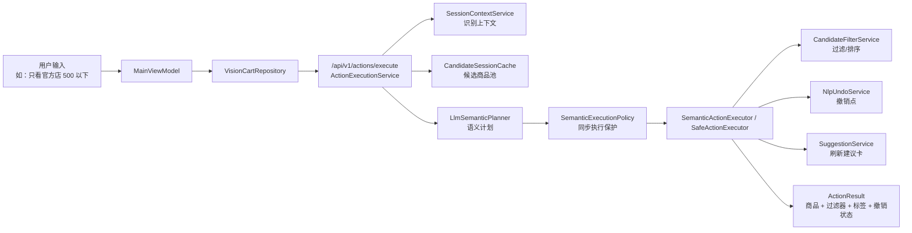

自然语言筛选的边界重点是：LLM 只产出计划或补充判断，真正执行筛选、零结果保护、撤销点保存和标签生成由后端确定性服务完成。这样可以降低模型输出不稳定对商品列表的影响。

### 5.5 收藏、历史与价格提醒数据流

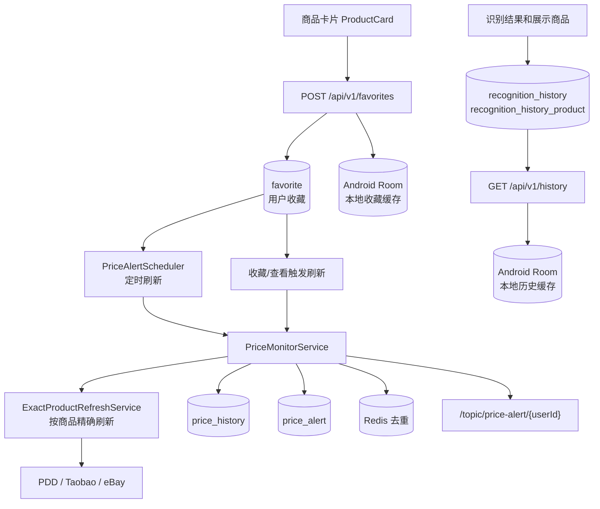

后端 MySQL 是收藏、历史和价格提醒的权威数据源；Android Room 是本地体验缓存。客户端在登录后同步服务端数据，离线新增收藏会在下一次同步时尝试推送到后端。

## 6. 数据模型与数据归属

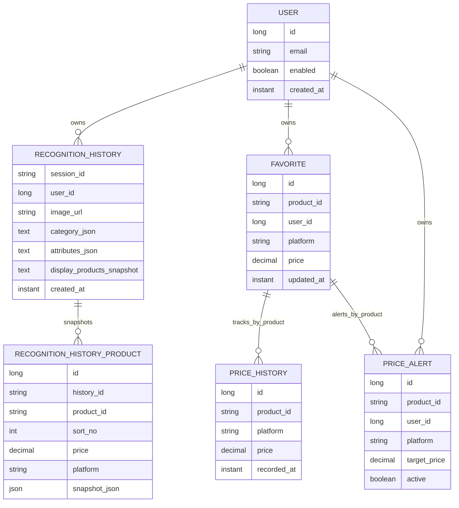

### 6.1 数据归属说明

| 数据 | 权威位置 | 客户端缓存 | 说明 |
| --- | --- | --- | --- |
| 用户与 Token | MySQL + JWT/RefreshToken | DataStore | Android 只缓存 Token 和用户基本信息 |
| 识别任务状态 | Redis / TaskManager | UI 状态 | 任务状态有 TTL，完成后会写历史 |
| 识别历史 | MySQL `recognition_history` | Room `recognition_history` | Room 用于本地列表与离线查看 |
| 展示商品快照 | MySQL `recognition_history_product` / JSON snapshot | 可由历史恢复到 UI | 避免历史页面重新搜索导致结果漂移 |
| 搜索候选池 | Redis `CandidateSessionCache` | UI 当前状态 | 支撑 NLP 筛选、排序、撤销 |
| 收藏 | MySQL `favorite` | Room `favorite_products` | 支持离线可用与同步 |
| 价格历史/提醒 | MySQL `price_history`、`price_alert` | UI 查询结果 | Redis 只做通知去重 |

## 7. 外部接口与边界

### 7.1 REST API 分组

| API 组 | 入口 | 责任 |
| --- | --- | --- |
| Auth | `/api/v1/auth/*` | 邮箱验证码、登录、刷新 Token、登出、用户资料 |
| Recognition | `/api/v1/recognition/*` | 图片识别、状态查询、多商品选择、属性修正、候选图读取 |
| Search | `/api/v1/search/products` | 多平台商品检索与比价 |
| NLP / Action | `/api/v1/nlp/*`、`/api/v1/actions/*` | 自然语言解析、筛选、排序、撤销、统一动作执行 |
| Suggestions | `/api/v1/suggestions/*` | 推荐卡片和建议动作 |
| Favorites / History | `/api/v1/favorites`、`/api/v1/history` | 收藏与识别历史同步 |
| Price | `/api/v1/price-alerts`、`/api/v1/price-history` | 价格提醒和价格历史 |
| Health / Metrics | `/api/v1/health`、`/api/v1/metrics/*`、`/actuator/*` | 健康检查与监控 |

### 7.2 WebSocket Topic

| Topic | 数据 | 权限边界 |
| --- | --- | --- |
| `/topic/recognition/{sessionId}` | 识别进度、失败、多商品候选、最终结果 | `WebSocketConfig` 校验任务归属 |
| `/topic/search/{sessionId}` | 阶段性搜索结果 | 校验任务归属或历史归属 |
| `/topic/price-alert/{userId}` | 价格提醒通知 | 只能订阅自己的 `userId` |

WebSocket CONNECT/SUBSCRIBE 会校验 JWT，防止跨用户订阅识别、搜索和价格提醒主题。

## 8. 关键设计决策

### 8.1 识别使用异步会话

移动端上传图片后不等待视觉模型同步完成，而是立即返回 `session_id`。这样做有三个收益：

- 避免移动网络和模型响应时间导致请求长时间阻塞。
- 支持 WebSocket 推送进度，也支持 HTTP 轮询兜底。
- 会话 ID 成为后续搜索、筛选、历史归档和撤销的统一上下文键。

### 8.2 搜索平台通过统一接口隔离

拼多多、淘宝联盟和 eBay 的鉴权、字段、价格单位和结果质量不同。后端用 `PlatformSearchService` 把平台差异封装在各平台服务中，`SearchOrchestrator` 只处理统一的 `ProductCard` 列表。

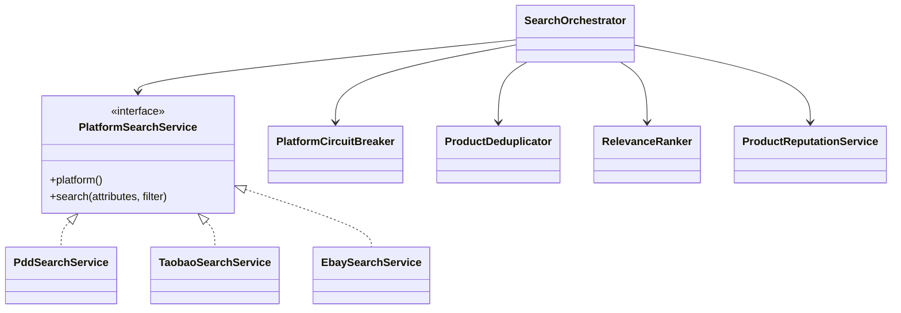

### 8.3 LLM 不直接改写结果

自然语言筛选和导购建议会调用 LLM，但 LLM 输出先进入语义计划、策略归一化和安全执行器。真正对商品池生效的是后端确定性逻辑，包括：

- `SemanticExecutionPolicy` 控制大候选池或主观偏好场景的执行方式。
- `SafeActionExecutor` 做零结果保护，避免一次筛选把结果清空。
- `NlpUndoService` 保存撤销点，支持用户回退。
- `ActionExecutionService` 统一 NLP、建议卡、排序、手动筛选、属性修正、标签删除等动作。

### 8.4 后端保存历史快照

搜索平台结果会随时间变化，如果历史页面每次重新搜索，会出现“同一次识别历史看见不同商品”的问题。因此搜索完成后会把展示给用户的商品列表归档到 MySQL，历史详情优先读取快照。

## 9. 安全与配置边界

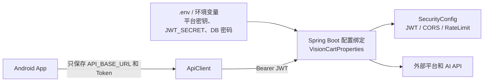

安全边界如下：

- 所有平台密钥、AI Key、SMTP 密码、数据库密码只放后端环境变量。
- Android 只注入 `VISIONCART_API_BASE_URL`，不包含第三方平台密钥。
- 后端统一校验 JWT，并对识别会话、历史、WebSocket topic 做用户归属检查。
- 发布版 Android 要求后端地址是非 localhost/LAN 的 HTTPS。
- 识别上传大小、图片尺寸、接口限流、平台超时、线程池容量都由后端配置控制。

## 10. 部署与运行视图

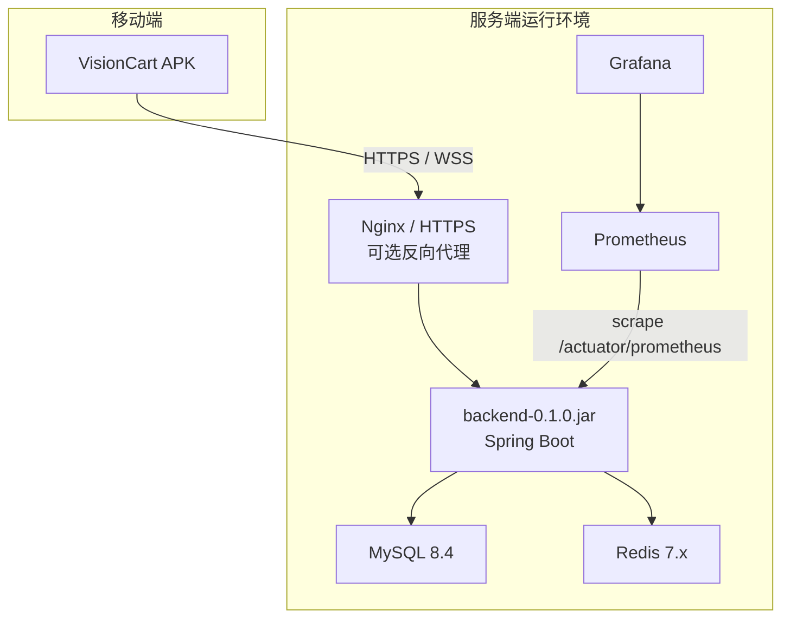

本地开发可直接运行后端 `8080` 端口；Docker Compose 可启动后端、MySQL、Redis、Prometheus 和 Grafana。Android 模拟器访问本机后端使用 `http://10.0.2.2:8080/`，真机使用电脑局域网 IP 或 ADB 端口转发。

## 11. 扩展点

| 扩展方向 | 推荐落点 | 注意事项 |
| --- | --- | --- |
| 新增商品平台 | 新增 `PlatformSearchService` 实现，并补充 `visioncart.platforms.*` 配置 | 输出必须转换为统一 `ProductCard` |
| 新增垂直品类策略 | `service/search/strategy` | 不应绕过 `IntentGate` 和候选池缓存 |
| 新增自然语言动作 | `ActionExecutionService` + `ActionCompiler` / `SemanticActionExecutor` | 需要定义撤销行为和零结果保护 |
| 新增推荐卡片 | `SuggestionService` / `DeepSuggestionService` | 区分 `FILTER_ACTION` 与 `FLOW_ACTION` |
| 新增价格提醒类型 | `PriceMonitorService` | 需要 Redis 去重策略，避免重复推送 |
| 新增客户端页面 | `ui/*` + `MainViewModel` 状态字段 | 网络和数据库访问仍通过 repository |

## 12. 架构约束总结

- 客户端只负责交互、本地体验和缓存；业务权威判断放后端。
- 后端 Controller 只处理入站、鉴权和归属校验；复杂业务进入 Service。
- 第三方平台和 AI 能力必须经服务层适配，不直接暴露给 Android。
- Redis 保存运行时上下文，MySQL 保存可追溯业务数据。
- 搜索结果、筛选结果和建议动作都围绕 `session_id` 组织，以保证识别、搜索、NLP、撤销、历史之间可串联。
- LLM 输出不能直接成为最终业务状态，必须经过确定性执行器和安全策略。
